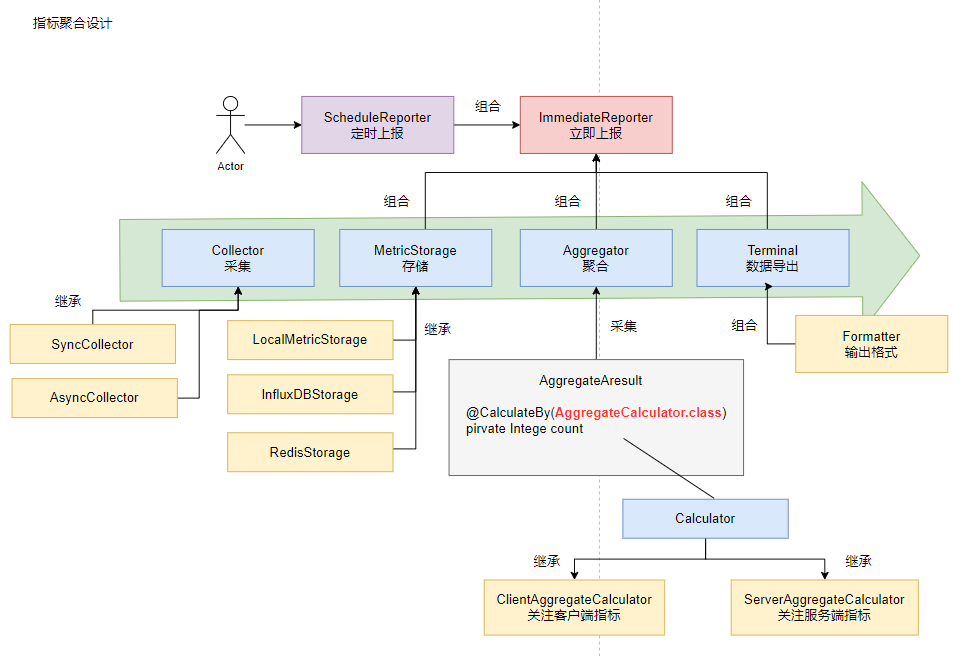

#  API-Monitor

对于部署在生产环境的 Web 应用，接口的性能监控尤为重要，运维人员可以了解系统当前负载、开发人员可根据监控数据分析瓶颈、进行系统调优。市面上有很多优秀、易用的监控告警产品。如 Open-Falcon、夜莺等。
但这些组件架构相对复杂，对于单体应用而言引入这些组件会增加系统复杂度、降低告警即时性，因此笔者希望编写一款具备拓展性、轻量级的 API 接口性能监控工具，无需外部依赖可以直接引用。



##  调研工作 
* 如何利用设计模式、设计原则编写出拓展性强、可测性强、易用易读的代码：[DESIGN.md](DESIGN.md)
* 应该在哪里采集什么指标：[API 参数说明](https://github.com/Rhythm-2019/api-monitor/issues/1)
* 如何存储指标数据：[时序数据库调研](https://github.com/Rhythm-2019/api-monitor/issues/2)

难点和挑战：
1. 容易产生 OOM：
2. 采集增加了响应时间：

## Quick Start

下载安装依赖

```bash
$ git clone https://github.com/Rhythm-2019/api-monitor.git
$ mvn install 
```

项目中引入

```xml
<dependency>
   <groupId>org.example</groupId>
    <artifactId>api-monitor</artifactId>
    <version>0.0.1</version>
</dependency>
```

###  采集

构造 MetricCollector

```java
// 本地内存作为存储介质（基于跳表）
LocalStorage localStorage = new LocalStorage();
// InfluxDB 作为存储介质（基于 LSM）
InfluxDBIMetricStorage influxDBIMetricStorage = new InfluxDBIMetricStorage(...);
// 采集器会将指标分发到介质中
DefaultMetricCollector collector = new DefaultMetricCollector(Arrays.asList(localStorage));
```

* 在客户端埋点，服务端接收客户端采集的指标（如响应时间）

```java
public class ClientMtericController {
    @Autowired
    private MetricCollector metricCollector;
    
    @PostMapping("/client/metric")
    public R hello(@RequestBody ClientMetric metric) {
        metricCollector.mark(metric);
        return R.ok();
    }
}

```

* 在服务端埋点（可以使用 AOP 织入），服务端保存服务端产生的指标（花费时间，HTTP 状态码等）

```java
@RestContrller
public class DemoController {
    @Autowired
    private MetricCollector metricCollector;
    
    @GetMapping("hello")
    public R hello() {
        // ...
        ServerMetric metric = new ServerMetric();
        metric.setSpendTime(...);
        metric.setServerName(...);
        metric.setUri(...);
        metricCollector.mark(metric);
        
        return R.ok();
    }
}
```

###  聚合上报

AggregateResult 是默认提供的聚合结果，大家可以参考它编写自定义聚合结果实体，字段上标注聚合处理器

```java
@Data
@ToString
public class MyAggregateResult extends AggregateResult {

    /**
     * 时间间隔
     */
    private long duration;

    /**
     * 客户端请求次数
     */
    @CalculateBy(ClientCountCalculator.class)
    private Integer clientCount;
    
    ...

}
```

编写聚合处理器时需要根据客户端指标聚合或服务端指标聚合选择实现 ClientAggregateCalculator 或 ServerAggregateCalculator

在 Web 应用启动时启动聚合上报
```java
// 参数为聚合结果保存的实体
Aggregator aggregator = new Aggregator(AggregateResult.class);
// 参数分别为服务名称、需要监控的 URI 列表、对于哪一个存储介质进行数据聚合、聚合方式、输出终端
ScheduleReport scheduleReport = new ScheduleReport("server-test", Arrays.asList("111", "222"), localStorage, aggregator, new ConsoleTerminal(new JsonFormatter()));
// 参数分别为为汇报间隔，统计时间间隔
schduleReporter.start(3_000, 10_000);
```


###  拓展点

1. 指标项可拓展：指标分为客户端指标和服务器指标，可以通过继承方式拓展
2. 存储介质可调整：可以自己实现 Redis 作为时序数据库进行指标存储，只需要实现 MetricStorage 接口即可
3. 聚合方式可拓展：编写自定义类继承 AggregateResult，在字段上标记 @CalculateBy 注解指定聚合函数
4. 输出可配置：比如需要使用 API 导出 XML，可以继承 Terminal 和 Formatter 实现
